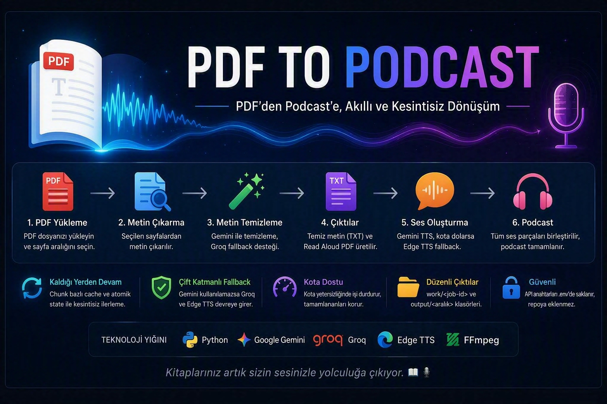

# PDF to Podcast

PDF sayfalarindan temiz metin, Read Aloud PDF ve podcast sesi ureten,
kota durumunda kaldigi yerden devam edebilen Python pipeline'i.

## Ozellikler

- Secilen fiziksel PDF sayfalarindan metin cikarma
- Mekanik on temizlik ve Gemini metin temizligi
- Gemini kullanilamazsa Groq metin fallback'i
- Her durumda `clean_text.txt` ve `readaloud.pdf` uretimi
- Gemini TTS ve Edge TTS fallback'i
- Chunk bazli cache, atomik state ve kota sonrasi resume
- Tamamlanan seslerden otomatik kismi podcast
- `work/<job-id>` ve `output/<baslangic>-<bitis>` dizinleri

## Gereksinimler

- Python 3.12 veya uyumlu yeni bir Python 3 surumu
- FFmpeg (`ffmpeg` ve `ffprobe` PATH uzerinde olmali)
- Gemini API anahtari
- Opsiyonel Groq API anahtari

## Kurulum

```powershell
python -m venv .venv
Set-ExecutionPolicy -Scope Process -ExecutionPolicy RemoteSigned
.\.venv\Scripts\Activate.ps1
python -m pip install -r .\requirements.txt
Copy-Item .\.env.example .\.env
```

Yeni `.env` dosyasina kendi API anahtarlarinizi yazin. `.env` Git tarafindan
yok sayilir ve kesinlikle repoya eklenmemelidir.

PDF dosyanizi yerel `input` klasorune koyun:

```powershell
New-Item -ItemType Directory -Force .\input
```

## Kullanim

Tum pipeline'i calistirmak:

```powershell
python .\podcast_from_pdf.py `
    --pdf ".\input\kitap.pdf" `
    --start-page 8 `
    --end-page 334
```

Bir calistirmada yaklasik 20 dakikalik yeni ses hedeflemek:

```powershell
python .\podcast_from_pdf.py `
    --pdf ".\input\kitap.pdf" `
    --start-page 8 `
    --end-page 334 `
    --target-minutes 20
```

Mevcut isin yalniz TTS asamasina devam etmek:

```powershell
python .\podcast_from_pdf.py `
    --stage tts `
    --job-dir ".\work\8-334" `
    --target-minutes 20
```

Gemini kotasi dolarsa tamamlanan WAV dosyalari korunur ve Edge TTS denenir.
Edge islemi de yarida kesilirse dogrulanmis MP3 parcalari kismi podcast olarak
birlestirilir. Ayni komut yeniden calistirildiginda mevcut cache kullanilir.

## Ciktilar

Her is sayfa araligiyla adlandirilir:

```text
work/<job-id>/  # state, chunk ve cache dosyalari
output/8-334/   # temiz metin, Read Aloud PDF ve podcast
```

Bu dizinler kullanici verisi ve uretilmis buyuk dosyalar icerdigi icin GitHub'a
yuklenmez.

## Testler

```powershell
.\.venv\Scripts\python.exe -m unittest discover -s tests
```

## Yardim

Ayrintili Turkce kullanim kilavuzu icin
[HELP_PODCAST_FROM_PDF.md](HELP_PODCAST_FROM_PDF.md) dosyasina bakin.

Teknik gecmis ve proje notlari
[README_PROJECT_HANDOFF.md](README_PROJECT_HANDOFF.md) dosyasindadir.

## Guvenlik

- `.env`, API anahtarlari, giris PDF'leri ve uretilmis sesler repoya eklenmez.
- Komut satirinda API anahtari vermek shell gecmisinde anahtar birakabilir.
- Yanlislikla paylasilan anahtarlari saglayici panelinden iptal edip yenileyin.